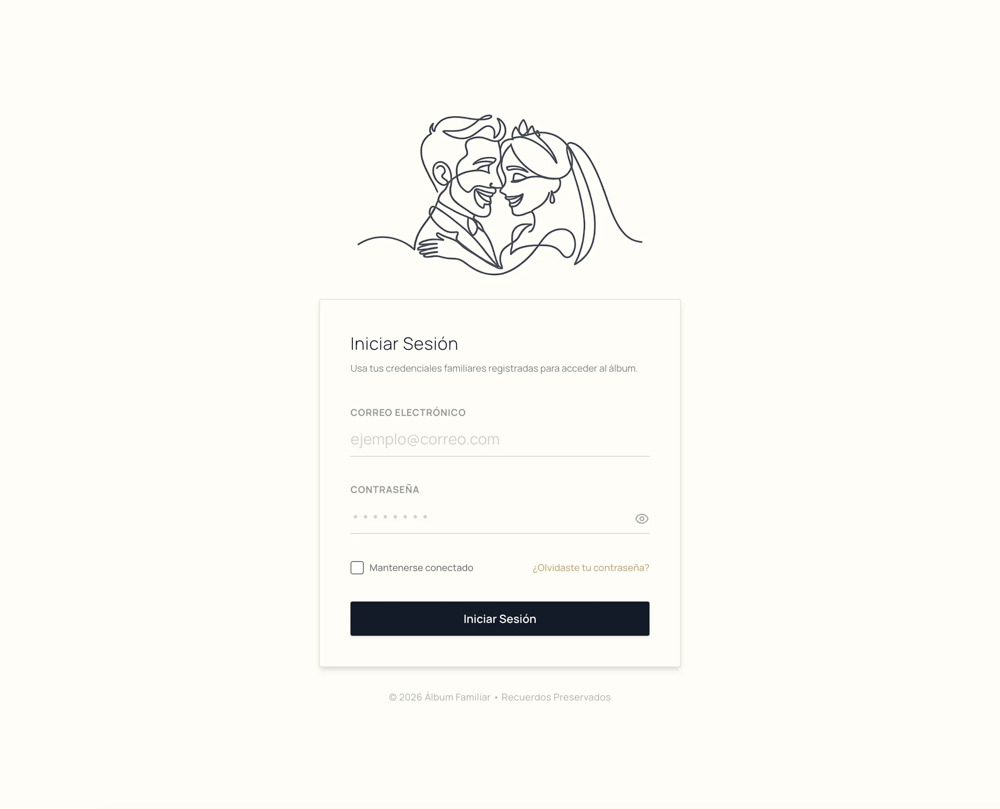
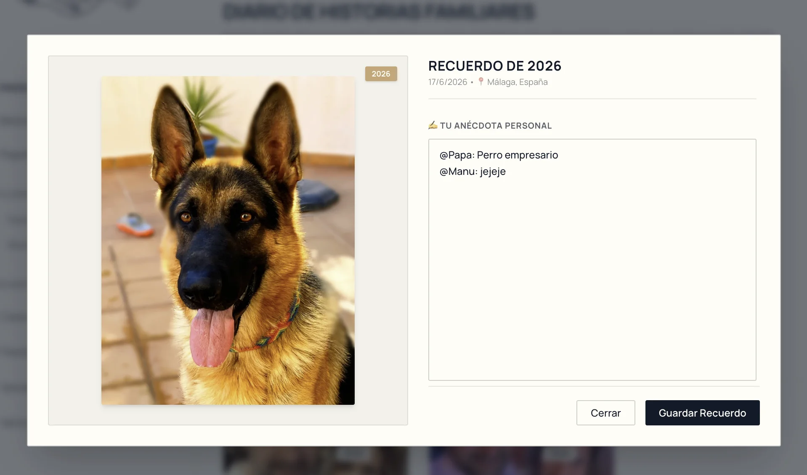
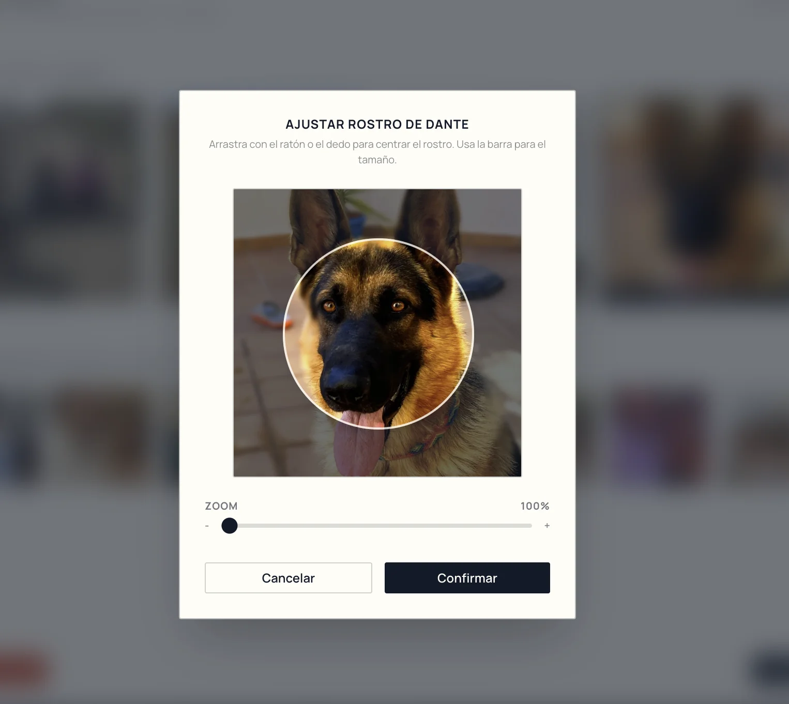
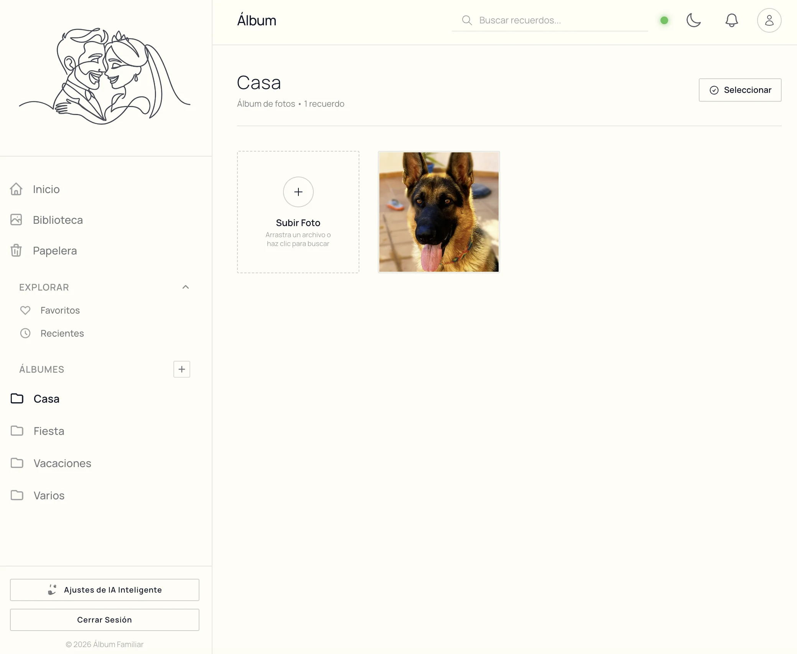

# 🗂️ Álbum Familiar: Preservando Nuestra Historia en la Era Digital

<div align="center">
  
  <p><em>Un espacio digital interactivo diseñado para reunir, catalogar y revivir los recuerdos más valiosos de nuestra familia.</em></p>

  [](https://nextjs.org/)
  [](https://react.dev/)
  [](https://tailwindcss.com/)
  [](https://supabase.com/)
  [](https://deepmind.google/technologies/gemini/)
</div>

---

## 🌟 Vision General

**Álbum Familiar** es una aplicación web premium de almacenamiento, catalogación e interactividad fotográfica. El proyecto trasciende los límites de una galería convencional al fusionar la **inteligencia artificial** de Google Gemini, **geolocalización inversa**, **sincronización híbrida (online/offline)** y una experiencia de usuario sumamente pulida, nostálgica y enriquecida con animaciones y micro-interacciones interactivas.

Diseñado tanto para pantallas táctiles en dispositivos móviles como para monitores de escritorio, permite crear álbumes, clasificar recuerdos mediante *Drag & Drop*, asociar fotos a perfiles de personas con herramientas de recorte facial y resguardar la tradición familiar mediante un diario de anécdotas compartidas.

---

## 📸 Demostración Visual (Capturas de Pantalla)

| Vista Principal (Dashboard) | Diario de Historias y Menciones |
|:---:|:---:|
|  <br> *Carrusel dinámico interactivo, línea de tiempo de recuerdos y acceso directo a álbumes.* |  <br> *Crónicas nostálgicas generadas por IA y anécdotas enriquecidas con menciones rápidas `@`.* |

| Recorte de Caras e Inteligencia de Personas | Organización por Álbumes (Drag & Drop) |
|:---:|:---:|
|  <br> *Detección y recorte de rostros con canvas para avatares de personas.* |  <br> *Clasificación instantánea de fotos arrastrándolas sobre el Sidebar lateral.* |

> [!NOTE]
> *Si eres desarrollador, puedes reemplazar los placeholders de arriba colocando tus capturas en una carpeta `/docs/screenshots/` en formato `.webp` o `.png`.*

---

## 🚀 Funcionalidades Clave

### 1. Búsqueda Inteligente Multicriterio
La barra de búsqueda analiza dinámicamente múltiples capas de datos para devolver resultados precisos de forma inmediata:
* **Nombres y Personas:** Filtra recuerdos donde aparezcan personas específicas basadas en el etiquetado.
* **Fechas y Estaciones:** Encuentra fotos buscando años específicos, meses (*"Enero"*, *"Marzo"*) o incluso estaciones del año (*"Verano"*, *"Otoño"*).
* **Navidad Inteligente:** Filtrado exclusivo de recuerdos navideños si se introduce la palabra *"Navidad"* (analiza fotos tomadas del 15 al 31 de diciembre).
* **Metadatos e IA:** Coincidencias en base al título de la foto, ubicación geográfica y etiquetas visuales.

### 2. Análisis Visual y Categorización con Gemini 1.5 Flash
Al subir fotos, si se dispone de una clave API de Gemini (que se puede configurar localmente de forma segura), el sistema:
* Envía la imagen comprimida en base64 junto con los metadatos de fecha y geolocalización.
* Genera de 3 a 5 etiquetas en español que describen de manera poética pero precisa el paisaje, clima, evento o entorno.
* Purgado de etiquetas genéricas (*"foto"*, *"recuerdo"*, *"familiar"*) para mantener una base de datos limpia y de alta calidad.

### 3. Geolocalización Inversa Nominatim (OSM)
Mediante el análisis de metadatos EXIF:
* Extrae las coordenadas GPS originales de las fotos (latitud y longitud).
* Consulta de forma gratuita la API de OpenStreetMap Nominatim para traducir las coordenadas en ubicaciones legibles (*Ciudad, País*).
* Permite buscar fotos escribiendo directamente el lugar donde fueron tomadas.

### 4. Diario Familiar con Menciones `@`
Cada recuerdo cuenta una historia. El diario cuenta con:
* **Crónicas Nostálgicas Automatizadas:** Un algoritmo con semillas basadas en el archivo que genera un preludio poético personalizado y evoca recuerdos lejanos.
* **Anécdotas Propias:** Espacio para que la familia documente la historia real detrás de la imagen.
* **Autocompletado de Menciones:** Al teclear `@` en el editor, se despliega un listado inteligente con los integrantes de la familia (`@Manu`, `@Papa`, `@Mama`, `@Pau`) para agilizar la narración interactiva.
* **Notificaciones de Actividad:** Cada vez que una historia se escribe o actualiza, se genera una notificación reactiva que avisa a los demás miembros y les permite navegar directamente al recuerdo clickeando la alerta.

### 5. Reconocimiento de Personas y Recorte Facial (FaceCropper)
* Permite crear perfiles familiares individuales o grupales.
* Incluye un **Recortador de Rostros interactivo en Canvas** (`FaceCropper.tsx`) que permite seleccionar áreas específicas de una foto familiar para usarlas como la foto de perfil del integrante.
* **Sugerencias Inteligentes:** La app cruza los tags del perfil de una persona con las etiquetas IA de las fotos no asociadas y sugiere automáticamente imágenes donde el integrante podría aparecer.

### 6. Sincronización Híbrida Online/Offline
Diseñado para funcionar bajo cualquier circunstancia:
* **Modo Offline Local:** Almacenamiento instantáneo en `localStorage` de rotaciones, historias, álbumes y metadatos.
* **Modo Online Supabase:** Persistencia en la nube de forma transparente.
* **Mapeo de Cola Pendiente:** Si se rotan o editan fotos sin internet, el sistema almacena las peticiones en una cola de pendientes (`pending_rotations`) y las sincroniza automáticamente con Supabase en cuanto se detecta la reconexión.
* **Fusión de Datos Inteligente:** Los métodos `syncLocalDataToSupabase` y `pullRemoteDataToLocal` se encargan de mezclar las modificaciones sin pisar datos del servidor.

### 7. Interfaz Premium de Gestión de Medios
* **Arrastrar y Soltar (Drag & Drop):** Clasificación ágil arrastrando miniaturas sobre el Sidebar.
* **Selección por Lotes (Bulk):** Permite seleccionar múltiples fotos para moverlas de álbum o enviarlas a la Papelera de una sola vez.
* **Lightbox Inmersivo:** Despliegue a pantalla completa de las imágenes en alta resolución con controles por teclado (flechas e `Esc`).
* **Háptica y Gestos en Móviles:** Menú contextual para móviles mediante pulsación larga (Long Press) con vibración háptica de confirmación (`navigator.vibrate`).
* **Modo Oscuro con Inversión del Logo:** Garantiza legibilidad perfecta aplicando una inversión inteligente de colores al logo corporativo (conservando los verdes nativos del isotipo).

---

## 🛠️ Stack Técnico

El proyecto está construido bajo una arquitectura moderna y eficiente de Frontend y Backend Serverless:

* **Framework:** [Next.js 16.2.7](https://nextjs.org/) (App Router & React Server Components).
* **Biblioteca de UI:** [React 19.2.4](https://react.dev/) (Hooks avanzados: `useState`, `useEffect`, `useRef`, `useSearchParams`).
* **Estilos:** [Tailwind CSS v4](https://tailwindcss.com/) & Vanilla CSS con variables de diseño CSS personalizadas para garantizar adaptabilidad y modo oscuro fluido.
* **Base de Datos y Autenticación:** [Supabase SDK](https://supabase.com/) (`@supabase/supabase-js` v2.107.0) para almacenamiento relacional y almacenamiento de objetos (Storage Bucket).
* **Procesamiento de Metadatos:** [exifr v7.1.3](https://github.com/MikeKovarik/exifr) para el parseo ultrarrápido de metadatos GPS y fechas de captura de imágenes directamente en el cliente.
* **Compresión en Cliente:** Algoritmo en Canvas para compresión y redimensionamiento dinámico a formato optimizado **WebP** antes de la subida a almacenamiento remoto.
* **Inteligencia Artificial:** API de [Google Gemini 1.5 Flash](https://deepmind.google/technologies/gemini/) para análisis multimodal de imágenes.
* **Geolocalización:** API de OpenStreetMap Nominatim.

---

## 🗄️ Esquema de Base de Datos (Supabase)

El proyecto cuenta con un diseño de almacenamiento ágil en Supabase. En lugar de crear múltiples tablas complejas, aprovecha el almacenamiento relacional de fotos y utiliza la tabla `albums` para persistir colecciones serializadas en JSON para configuraciones del sistema (personas, historias, metadatos y notificaciones).

### Scripts de Inicialización SQL

Ejecuta el siguiente script en el editor SQL de Supabase para estructurar la base de datos de tu proyecto:

```sql
-- 1. CREACIÓN DE LA TABLA DE ÁLBUMES
CREATE TABLE albums (
  id UUID PRIMARY KEY DEFAULT gen_random_uuid(),
  name TEXT NOT NULL,
  cover_url TEXT NULL, -- Guarda URL de portada o datos serializados JSON en el caso de __system_...
  created_at TIMESTAMPTZ DEFAULT now()
);

-- 2. CREACIÓN DE LA TABLA DE FOTOS
CREATE TABLE photos (
  id UUID PRIMARY KEY DEFAULT gen_random_uuid(),
  album_id UUID REFERENCES albums(id) ON DELETE SET NULL,
  status TEXT NULL, -- e.g., 'trash'
  rotation INTEGER DEFAULT 0,
  url_original TEXT NULL,
  url_thumbnail TEXT NULL,
  created_at TIMESTAMPTZ DEFAULT now()
);

-- 3. INSERTAR CONFIGURACIONES DE SISTEMA POR DEFECTO (Si no existen)
INSERT INTO albums (name, cover_url) VALUES 
('__system_config__', '{"people":[], "taggedPhotos":{}}'),
('__system_config_stories__', '{}'),
('__system_config_notifications__', '[]'),
('__system_config_metadata__', '{}')
ON CONFLICT DO NOTHING;
```

### Configuración del Storage de Supabase
1. Ve al panel de control de Supabase -> **Storage**.
2. Crea un Bucket llamado `family-album` y configúralo como **Público**.
3. Asegúrate de crear dos carpetas en la raíz del bucket:
   * `originals/` — Para guardar las imágenes de alta resolución.
   * `thumbnails/` — Para guardar las imágenes optimizadas webp de carga rápida.
4. Define las políticas RLS correspondientes para permitir lecturas públicas y escrituras a usuarios autenticados o administradores.

---

## 💻 Configuración e Instalación

Sigue estos pasos para levantar el entorno local:

### 1. Clonar el repositorio
```bash
git clone https://github.com/tu-usuario/album-familiar.git
cd album-familiar
```

### 2. Instalar dependencias
```bash
npm install
```

### 3. Configurar variables de entorno
Crea un archivo `.env.local` en la raíz del proyecto y completa los siguientes parámetros con tus credenciales de Supabase:

```env
NEXT_PUBLIC_SUPABASE_URL=https://tu-proyecto-id.supabase.co
NEXT_PUBLIC_SUPABASE_ANON_KEY=tu-clave-anonima-jwt
```

### 4. Correr servidor de desarrollo
```bash
npm run dev
```
La aplicación estará disponible en [http://localhost:3000](http://localhost:3000).

---

## 👥 Roles de Administración

El archivo [supabase.ts](file:///Volumes/Mac%20HD/Macintosh/Library/Mobile%20Documents/com~apple~CloudDocs/Web/3.0/Antigravity/album-familiar/lib/supabase.ts) define una lista de correos administradores que tienen permisos exclusivos para crear y eliminar álbumes, subir fotos y etiquetar personas.

Puedes configurar los correos autorizados editando la constante `ADMIN_EMAILS` en `lib/supabase.ts`:

```typescript
export const ADMIN_EMAILS = [
  "tu-correo@dominio.com",
  "otro-familiar@dominio.com"
];
```

---

## 🛡️ Reglas de Comportamiento e Integridad

* **Control de Errores de Base de Datos:** Todas las consultas a Supabase e interacciones de base de datos capturan explícitamente el objeto `{ error }`. En caso de fallo, se propaga el error y se muestra inmediatamente en la interfaz al usuario mediante un Banner/Toast premium en la parte superior.
* **Seguridad de Datos:** La sincronización híbrida asegura que ningún dato sea sobreescrito en el servidor sin previa validación y unión de metadatos locales.
